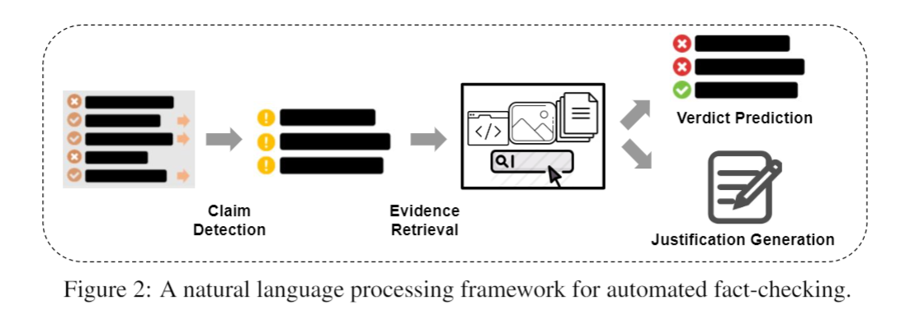
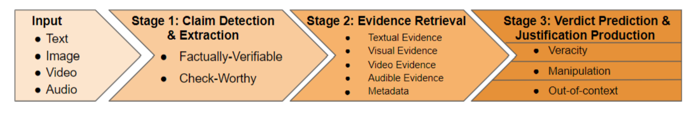

# Automated Fact-Checking Resources

## Overview

This repo contains relevant resources from our survey paper [A Survey on Automated Fact-Checking](https://direct.mit.edu/tacl/article/doi/10.1162/tacl_a_00454/109469/A-Survey-on-Automated-Fact-Checking) in TACL 2022 and the follow up multimodal survey paper [Multimodal Automated Fact-Checking: A Survey](https://arxiv.org/pdf/2305.13507.pdf). In this survey, we present a comprehensive and up-to-date survey of automated fact-checking (AFC), unifying various components and definitions developed in previous research into a common framework.  As automated fact-checking research is evolving, we will provide timely updates on the survey and this repo.

- [Task Definition](#task-definition)
- [Datasets](#datasets)
  - [Claim Detection and Extraction](#claim-detection-and-extraction-dataset)
  - [Verdict Prediction](#verdict-prediction-dataset)
    - [Veracity Classification](#veracity-classification-dataset)
      - [Natural Claims](#natural-claims)
      - [Artificial Claims](#artificial-claims)
    - [Out-of-context Classification](#out-of-context-classification-dataset)
    - [Manipulation Classification](#manipulation-classification-dataset)
- [Shared Tasks](#shared-tasks)
- [Models](#model)
  - [Claim Detection and Extraction](#claim-detection-and-extraction)
  - [Verdict Prediction](#verdict-prediction)
    - [Veracity Classification](#veracity-classification)
    - [Out-of-context Classification](#out-of-context-classification)
    - [Manipulation Classification](#manipulation-classification)
  - [Justification Production](#justification-production)
- [Relevant Surveys](#relevant-surveys)
  - [Automated Fact-Checking](#automated-fact-checking)
  - [Fake News Detection](#fake-news-detection)
  - [Claim Detection Related](#claim-detection-related)
  - [Stance Detection](#stance-detection)
- [Related Tasks](#related-tasks)
  - [Misinformation and Disinformation](#misinformation-and-disinformation)
  - [Detecting Previous Claims](#detecting-previous-claims)
- [Tutorials](#tutorials)

## Task Definition
Figure below shows a NLP framework for automated fact-checking (AFC) with text consisting of three stages:  
1. Claim detection to identify claims that require verification; 
2. Evidence retrievalto find sources supporting or refuting the claim; 
3. Claim verification to assess the veracity of the claim based on the retrieved evidence. 

Evidence retrieval and claim verification are sometimes tackled as a single task referred to asfactual verification, while claim detection is often tackled separately. Claim verificationcan be decomposed into two parts that can be tackled separately or jointly: verdict prediction, where claims are assigned truthfulness labels, and justification production, where explanations for verdicts must be produced.

In the follow up multimodal survey, we extends the first stage with a claim extraction step, and generalises the third stage to cover tasks that fall under multimodal AFC:

1. Claim Detection and Extraction: multiple modalities can be required to understand and extract a claim at this stage. Simply detecting misleading content is often not enough – it is necessary to extract the claim before fact-checking it in the subsequent stages.
2. Evidence Retrieval: similarly to fact-checking with text, multimodal fact-checking relies on evidence to make judgments.
3. Verdict Prediction and Justification Production: it is decomposed into three tasks considering prevalent ways that multimodal misinformation can be conveyed:
    - Manipulation Classification: classify misinformative claims with manipulated content or correct claims accompanied by manipulated content.
    - Out-of-context Classification: detect unchanged content from a different context.
    - Veracity Classification: classify the veracity of textual claims given retrieved evidence.

## Datasets
### Claim Detection and Extraction Dataset
* MR2: A Benchmark for Multimodal Retrieval-Augmented Rumor Detection in Social Media (Hu et al., 2023)
  [[Paper]](https://dl.acm.org/doi/10.1145/3539618.3591896)
  [[Dataset]](https://github.com/THU-BPM/MR2)
  **SIGIR 2023**
* FakeSV: A Multimodal Benchmark with Rich Social Context for Fake News Detection on Short Video Platforms (Qi et al., 2023)
  [[Paper]](https://arxiv.org/pdf/2211.10973.pdf)
  [[Dataset]](https://github.com/ictmcg/fakesv)
    **AAAI 2023**
* SciTweets - A Dataset and Annotation Framework for Detecting Scientific Online Discourse (Hafid et al., 2022)
  [[Paper]](https://arxiv.org/pdf/2206.07360.pdf)
  [[Dataset]](https://github.com/AI-4-Sci/SciTweets)
    **CIKM 2022**
* Empowering the Fact-checkers! Automatic Identification of Claim Spans on Twitter (Sundriyal et al., 2022)
  [[Paper]](https://arxiv.org/pdf/2210.04710.pdf)
  [[Dataset]](https://github.com/LCS2-IIITD/DABERTA-EMNLP-2022)
  **EMNLP 2022**
* Stanceosaurus: Classifying Stance Towards Multilingual Misinformation (Zheng et al., 2022)
  [[Paper]](https://arxiv.org/pdf/2210.15954.pdf)
  [[Dataset]](https://github.com/JonathanQZheng/Stanceosaurus/)
  **EMNLP 2022**
* Challenges and Opportunities in Information Manipulation Detection: An Examination of Wartime Russian Media  (Park et al., 2022)
  [[Paper]](https://arxiv.org/pdf/2205.12382.pdf)
  **Findings EMNLP 2022**
* CoVERT: A Corpus of Fact-checked Biomedical COVID-19 Tweets (Mohr et al., 2022)
  [[Paper]](https://arxiv.org/pdf/2204.12164.pdf)
  [[Dataset]](https://www.ims.uni-stuttgart.de/forschung/ressourcen/korpora/bioclaim/)
  **LREC 2021**
* MuMiN: A Large-Scale Multilingual Multimodal Fact-Checked Misinformation Social Network Dataset (Nielsen et al., 2022)
  [[Paper]](https://arxiv.org/pdf/2202.11684.pdf)
  [[Dataset]](https://mumin-dataset.github.io/gettingstarted/)
  **SIGIR 2021**
* STANKER: Stacking Network based on Level-grained Attention-masked BERT for Rumor Detection on Social Media (Rao et al., 2021)
  [[Paper]](https://aclanthology.org/2021.emnlp-main.269.pdf)
  [[Dataset]](https://github.com/fip-lab/STANKER)
  **EMNLP 2021**
* Fighting the COVID-19 Infodemic: Modeling the Perspective of Journalists, Fact-Checkers, Social Media Platforms, Policy Makers, and the Society (Alam et al., 2021)
  [[Paper]](https://aclanthology.org/2021.findings-emnlp.56.pdf)
  [[Dataset]](https://github.com/firojalam/COVID-19-disinformation)
  **Findings EMNLP 2021**
* Towards Automated Factchecking: Developing an Annotation Schema and Benchmark for Consistent Automated Claim Detection (Konstantinovskiy et al., 2021)
  [[Paper]](https://arxiv.org/pdf/1809.08193.pdf)
  **ACM Digital Threats: Research and Practice 2021**
* The CLEF-2021 CheckThat! Lab on Detecting Check-Worthy Claims, Previously Fact-Checked Claims, and Fake News (Nakov et al., 2021)
  [[Paper]](https://link.springer.com/chapter/10.1007%2F978-3-030-72240-1_75)
  [[Dataset]](https://sites.google.com/view/clef2021-checkthat/tasks/task-1-check-worthiness-estimation)
* Mining Dual Emotion for Fake News Detection (Zhang et al., 2021)
  [[Paper]](https://arxiv.org/pdf/1903.01728.pdf)
  [[Dataset]](https://drive.google.com/drive/folders/1pjK0BYiiJt0Ya2nRIrOLCVo-o53sYRBV)
  **WWW 2021**
* Overview of CheckThat! 2020: Automatic Identification and Verification of Claims in Social Media (Barrón-Cedeño et al., 2020)
  [[Paper]](https://link.springer.com/chapter/10.1007%2F978-3-030-58219-7_17)
  [[Dataset]](https://sites.google.com/view/clef2020-checkthat/datasets-tools)
* Citation Needed: A Taxonomy and Algorithmic Assessment of Wikipedia's Verifiability (Redi et al., 2019)
  [[Paper]](https://arxiv.org/pdf/1902.11116.pdf)
  [[Dataset]](https://figshare.com/articles/dataset/Citation_Reason_Dataset/7756226)
* SemEval-2019 Task 7: RumourEval, Determining Rumour Veracity and Support for Rumours (Gorrell et al., 2019).
  [[Paper]](https://www.aclweb.org/anthology/S19-2147.pdf)
  [[Dataset]](https://competitions.codalab.org/competitions/19938)
* Joint Rumour Stance and Veracity (Lillie et al., 2019)
  [[Paper]](https://aclanthology.org/W19-6122.pdf)
  [[Dataset]](https://figshare.com/articles/dataset/RumourEval_2019_data/8845580)
* Overview of the CLEF-2018 CheckThat! Lab on Automatic Identification and Verification of Political Claims. Task 1: Check-Worthiness (Atanasova et al., 2018)
  [[Paper]](http://ceur-ws.org/Vol-2125/invited_paper_13.pdf)
  [[Dataset]](https://github.com/clef2018-factchecking/clef2018-factchecking/#subtasks)
* Separating Facts from Fiction: Linguistic Models to Classify Suspicious and Trusted News Posts on Twitter (Volkova et al., 2017)
  [[Paper]](https://aclanthology.org/P17-2102.pdf)
  [[Dataset]](https://aclanthology.org/attachments/P17-2102.Datasets.zip)
  **ACL 2017**
* A Context-Aware Approach for Detecting Worth-Checking Claims in Political Debates (Gencheva et al., 2017)
  [[Paper]](https://www.acl-bg.org/proceedings/2017/RANLP%202017/pdf/RANLP037.pdf)
  [[Dataset]](https://github.com/apepa/claim-rank)
  **RANLP 2017**
* Multimodal Fusion with Recurrent Neural Networks for Rumor Detection on Microblogs (Jin et al., 2017)
  [[Paper]](https://dl.acm.org/doi/10.1145/3123266.3123454)
  **ACM MM 2017**
* SemEval-2017 Task 8: RumourEval: Determining rumour veracity and support for rumours (Derczynski et al., 2017).
  [[Paper]](https://www.aclweb.org/anthology/S17-2006.pdf)
  [[Dataset]](https://alt.qcri.org/semeval2017/task8/index.php?id=data-and-tools)
* Detecting Rumors from Microblogs with Recurrent Neural Networks (Ma et al., 2016)
  [[Paper]](https://www.ijcai.org/Proceedings/16/Papers/537.pdf)
  [[Dataset]](https://www.dropbox.com/s/46r50ctrfa0ur1o/rumdect.zip?dl=0)
  **IJCAI 2016**
* Analysing How People Orient to and Spread Rumours in Social Media by Looking at Conversational Threads (Zubiaga et al., 2016).
  [[Paper]](https://journals.plos.org/plosone/article?id=10.1371/journal.pone.0150989)
  [[Dataset]](https://figshare.com/articles/PHEME_rumour_scheme_dataset_journalism_use_case/2068650)
  **PLOS One 2016**
* CREDBANK: A Large-Scale Social Media Corpus with Associated Credibility Annotations (Mitra and Gilbert, 2015).
  [[Paper]](http://eegilbert.org/papers/icwsm15.credbank.mitra.pdf)
  [[Dataset]](https://github.com/compsocial/CREDBANK-data)
  **ICWSM 2015**
* Detecting Check-worthy Factual Claims in Presidential Debates (Hassan et al., 2015)
  [[Paper]](https://idir.uta.edu/~naeemul/file/factchecking-cikm15-hassan-cameraready.pdf)
  **CIKM 2015**

### Verdict Prediction Dataset
#### Veracity Classification Dataset
##### Natural Claims
* Do Large Language Models Know about Facts? (Xu et al., 2024)
  [[Paper]](https://openreview.net/forum?id=9OevMUdods)
  **ICLR 2024**
* COVID-VTS: Fact Extraction and Verification on Short Video Platforms (Liu et al., 2023)
  [[Paper]](https://arxiv.org/pdf/2302.07919.pdf) 
  [[Dataset]](https://github.com/FuxiaoLiu/Twitter-Video-dataset) 
  [[Code]](https://github.com/FuxiaoLiu/Twitter-Video-dataset) 
  **EACL 2023**
* End-to-End Multimodal Fact-Checking and Explanation Generation: A Challenging Dataset and Models (Yao et al., 2023)
  [[Paper]](https://arxiv.org/pdf/2205.12487.pdf)
  [[Dataset]](https://github.com/VT-NLP/Mocheg)
  **SIGIR 2023**
* Modeling Information Change in Science Communication with Semantically Matched Paraphrases (Wright et al., 2022)
  [[Paper]](https://arxiv.org/pdf/2210.13001.pdf) 
  [[Dataset]](https://huggingface.co/datasets/copenlu/spiced) 
  [[Code]](https://github.com/copenlu/scientific-information-change) 
  **EMNLP 2022**
* Generating Literal and Implied Subquestions to Fact-check Complex Claims (Chen et al., 2022)
  [[Paper]](https://arxiv.org/pdf/2205.06938.pdf) 
  [[Dataset]](https://jifan-chen.github.io/ClaimDecomp/) 
  **EMNLP 2022**
* CHEF: A Pilot Chinese Dataset for Evidence-Based Fact-Checking (Hu et al., 2022)
  [[Paper]](https://arxiv.org/pdf/2206.11863.pdf) 
  [[Dataset]](https://github.com/THU-BPM/CHEF) 
  **NAACL 2022**
* WatClaimCheck: A new Dataset for Claim Entailment and Inference (Khan et al., 2022) 
  [[Paper]](https://aclanthology.org/2022.acl-long.92.pdf) 
  [[Dataset]](https://github.com/nxii/WatClaimCheck) 
  **ACL 2022**
* Open-Domain, Content-based, Multi-modal Fact-checking of Out-of-Context Images via Online Resources (Abdelnabi et al., 2022)
  [[Paper]](https://arxiv.org/pdf/2112.00061.pdf)
  [[Dataset]](https://s-abdelnabi.github.io/OoC-multi-modal-fc/)
  **CVPR 2022**
* MMM: An Emotion and Novelty-aware Approach for Multilingual Multimodal Misinformation Detection (Gupta et al., 2022)
  [[Paper]](https://aclanthology.org/2022.findings-aacl.43.pdf) 
  [[Dataset]](https://www.iitp.ac.in/~ai-nlp-ml/resources.html#MMM_Dataset) 
  **AACL 2022**
* FactDrill: A Data Repository of Fact-Checked Social Media Content to Study Fake News Incidents in India (Singhal et al., 2022)
  [[Paper]](https://ojs.aaai.org/index.php/ICWSM/article/view/19384/19156) 
  **ICWSM 2022**
* Evidence-based Fact-Checking of Health-related Claims (Sarrouti et al., 2021)
  [[Paper]](https://aclanthology.org/2021.findings-emnlp.297.pdf)
  [[Dataset]](https://github.com/sarrouti/healthver)
  **Findings EMNLP 2021**
* COVID-Fact: Fact Extraction and Verification of Real-World Claims on COVID-19 Pandemic (Saakyan et al., 2021)
  [[Paper]](https://arxiv.org/pdf/2106.03794.pdf)
  [[Dataset]](https://github.com/asaakyan/covidfact)
  **ACL 2021**
* Edited Media Understanding Frames: Reasoning About the Intents and Implications of Visual Disinformation (Da et al., 2021)
  [[Paper]](https://aclanthology.org/2021.acl-long.158.pdf)
  [[Code]](https://jeffda.com/edited-media-understanding)
  **ACL 2021**
* Structurizing Misinformation Stories via Rationalizing Fact-Checks (Jiang et al., 2021)
  [[Paper]](https://aclanthology.org/2021.acl-long.51.pdf)
  [[Dataset]](https://shanjiang.me/resources/#fact-check)
  **ACL 2021**
* X-FACT: A New Benchmark Dataset for Multilingual Fact Checking (Gupta and Srikumar, 2021)
  [[Paper]](https://aclanthology.org/2021.acl-short.86.pdf)
  [[Dataset]](https://github.com/utahnlp/x-fact)
  **ACL 2021**
* LUX (Linguistic aspects Under eXamination): Discourse Analysis for Automatic Fake News Classification (Azevedo et al., 2021)
  [[Paper]](https://aclanthology.org/2021.findings-acl.4.pdf)
  [[Code]](https://github.com/lucas0/Lux)
  **Findings ACL 2021**
* Meet The Truth: Leverage Objective Facts and Subjective Views for Interpretable Rumor Detection (Li et al., 2021)
  [[Paper]](https://aclanthology.org/2021.findings-acl.63.pdf)
  **Findings ACL 2021**
* Explainable Automated Fact-Checking for Public Health Claims (Kotonya and Toni, 2020b)
  [[Paper]](https://aclanthology.org/2020.emnlp-main.623.pdf)
  [[Dataset]](https://github.com/neemakot/Health-Fact-Checking)
  **EMNLP 2020**
* Fact or Fiction: Verifying Scientific Claims (Wadden et al., 2020).
  [[Paper]](https://www.aclweb.org/anthology/2020.emnlp-main.609.pdf)
  [[Dataset]](https://github.com/allenai/scifact)
  **EMNLP 2020**
* AnswerFact: Fact Checking in Product Question Answering (Zhang et al., 2020)
  [[Paper]](https://aclanthology.org/2020.emnlp-main.188.pdf)
  [[Dataset]](https://drive.google.com/file/d/1JAmbLlV0b8Fm03VnNeVEXmROvj1po2lN/view)
  **EMNLP 2020**
* Explainable Automated Fact-Checking for Public Health Claims (Kotonya and Toni, 2020). 
  [[Paper]](https://arxiv.org/abs/2010.09926)
  [[Dataset]](https://github.com/neemakot/Health-Fact-Checking)
  **EMNLP 2020**
* r/Fakeddit: A New Multimodal Benchmark Dataset for Fine-grained Fake News Detection (Nakamura et al., 2020).
  [[Paper]](https://www.aclweb.org/anthology/2020.lrec-1.755.pdf)
  [[Dataset]](https://github.com/entitize/fakeddit)
  **LREC 2020**
* CLIMATE-FEVER: A Dataset for Verification of Real-World Climate Claims (Diggelmann et al., 2020)
  [[Paper]](https://arxiv.org/pdf/2012.00614.pdf)
  [[Dataset]](https://www.sustainablefinance.uzh.ch/en/research/climate-fever.html)
  **Workshop @ NeurIPS 2020**
* FakeCovid-- A Multilingual Cross-domain Fact Check News Dataset for COVID-19 (Shahi and Nandini, 2020). 
  [[Paper]](https://arxiv.org/pdf/2006.11343.pdf)
  [[Dataset]](https://gautamshahi.github.io/FakeCovid/)  
  **ICWSM 2020**
* FakeNewsNet: A Data Repository with News Content, Social Context and Spatialtemporal Information for Studying Fake News on Social Media (Shu et al., 2020).
  [[Paper]](https://arxiv.org/pdf/1809.01286.pdf)
  [[Dataset]](https://github.com/KaiDMML/FakeNewsNet)
  **Big Data 2020**
* A Richly Annotated Corpus for Different Tasks in Automated Fact-Checking (Hanselowski et al., 2019).
  [[Paper]](https://www.aclweb.org/anthology/K19-1046.pdf)
  [[Code]](https://github.com/UKPLab/conll2019-snopes-crawling)
  [[Dataset](https://tudatalib.ulb.tu-darmstadt.de/handle/tudatalib/2081)]
  **CoNLL 2019**
* MultiFC: A Real-World Multi-Domain Dataset for Evidence-Based Fact Checking of Claims (Augenstein et al., 2019).
  [[Paper]](https://www.aclweb.org/anthology/D19-1475.pdf)
  [[Dataset]](https://competitions.codalab.org/competitions/21163)
  **EMNLP 2019**
* Fact-Checking Meets Fauxtography: Verifying Claims About Images (Zlatkova et al., 2019)
  [[Paper]](https://aclanthology.org/D19-1216.pdf)
  [[Dataset]](https://gitlab.com/didizlatkova/fake-image-detection)
  **EMNLP 2019**
* FA-KES: A Fake News Dataset around the Syrian War (Salem et al., 2019)
  [[Paper]](https://ojs.aaai.org/index.php/ICWSM/article/view/3254/3122)
  [[Dataset]](https://github.com/fakenewssyria/fake_news_detection)
  **ICWSM 2019**
* Fact Checking in Community Forums (Mihaylova et al., 2018)
  [[Paper]](https://www.aaai.org/ocs/index.php/AAAI/AAAI18/paper/view/16780/16082)
  [[Dataset]](https://github.com/qcri/QLFactChecking)
  **AAAI 2018**
* EANN: Event Adversarial Neural Networks for Multi-Modal Fake News Detection
  [[Paper]](https://dl.acm.org/doi/pdf/10.1145/3219819.3219903)
  [[Dataset]](https://github.com/yaqingwang/EANN-KDD18)
  **KDD 2018**
* Overview of the CLEF-2018 CheckThat! Lab on Automatic Identification and Verification of Political Claims. Task 2: Factuality  (Barrón-Cedeño et al., 2018)
  [[Paper]](http://ceur-ws.org/Vol-2125/invited_paper_14.pdf)
  [[Dataset]](https://github.com/clef2018-factchecking/clef2018-factchecking/#subtasks)
* Integrating Stance Detection and Fact Checking in a Unified Corpus (Baly et al., 2018).
  [[Paper]](https://www.aclweb.org/anthology/N18-2004.pdf)
  [[Dataset]](https://alt.qcri.org/resources/arabic-fact-checking-and-stance-detection-corpus/)
* A News Veracity Dataset with Facebook User Commentary and Egos (Santia and Williams, 2018)
  [[Paper]](https://aaai.org/ocs/index.php/ICWSM/ICWSM18/paper/view/17825/17046)]
  [[Dataset]](https://github.com/gsantia/BuzzFace)
  **ICWSM 2018**
* A Stylometric Inquiry into Hyperpartisan and Fake News (Potthast et al., 2018)
  [[Paper]](https://aclanthology.org/P18-1022.pdf)
  [[Dataset]](https://github.com/webis-de/ACL-18)
* Sampling the News Producers: A Large News and Feature Data Set for the Study of the Complex Media Landscape (Horne et al., 2018)
  [[Paper]](https://aaai.org/ocs/index.php/ICWSM/ICWSM18/paper/view/17796/17044)
  [[Dataset]](https://dataverse.harvard.edu/dataset.xhtml?persistentId=doi:10.7910/DVN/ZCXSKG)
* Truth of Varying Shades: Analyzing Language in Fake News and Political Fact-Checking (Rashkin et al., 2017).
  [[Paper]](https://www.aclweb.org/anthology/D17-1317.pdf)
  [[Dataset]](https://hrashkin.github.io/factcheck.html)
  **EMNLP 2017**
* “Liar, Liar Pants on Fire”: A New Benchmark Dataset for Fake News Detection (Wang, 2017).
  [[Paper]](https://www.aclweb.org/anthology/P17-2067.pdf)
  [[Dataset]](https://sites.cs.ucsb.edu/~william/software.html)
  **ACL 2017**
* Credibility Assessment of Textual Claims on the Web (Popat et al., 2016)
  [[Paper]](http://resources.mpi-inf.mpg.de/impact/web_credibility_analysis/cikm2016-popat.pdf)
  [[Dataset]](https://www.mpi-inf.mpg.de/departments/databases-and-information-systems/research/impact/web-credibility-analysis)
* Emergent: a novel data-set for stance classification (Ferreira and Vlachos, 2016)
  [[Paper]](https://aclanthology.org/N16-1138.pdf)
  [[Dataset]](https://github.com/willferreira/mscproject)
  **NAACL 2016**
* Fake News or Truth? Using Satirical Cues to Detect Potentially Misleading News (Rubin et al., 2016)
  [[Paper]](https://aclanthology.org/W16-0802.pdf) 
  **Workshop @ 2016**
* Identification and Verification of Simple Claims about Statistical Properties (Vlachos and Riedel, 2015)
  [[Paper]](https://aclanthology.org/D15-1312.pdf)
  [[Dataset]](https://github.com/uclnlp/simpleNumericalFactChecker)
  **EMNLP 2015**
* Fact Checking: Task definition and dataset construction (Vlachos and Riedel, 2014)
  [[Paper]](https://aclanthology.org/W14-2508.pdf)
  [[Dataset]](https://sites.google.com/site/andreasvlachos/resources)
  **Workshop @ ACL 2014**
* Verification and Implementation of Language-Based Deception Indicators in Civil and Criminal Narratives (Bachenko et al., 2008)
  [[Paper]](https://aclanthology.org/C08-1006.pdf)

##### Artificial Claims
* FACTKG: Fact Verification via Reasoning on Knowledge Graphs (Kim et al., 2023)
  [[Paper]](https://arxiv.org/pdf/2305.06590.pdf)
  [[Code]](https://github.com/jiho283/FactKG)
  [[Dataset]](https://drive.google.com/drive/folders/1q0_MqBeGAp5_cBJCBf_1alYaYm14OeTk?usp=share_link)
  **ACL 2023**
* Faking Fake News for Real Fake News Detection: Propaganda-loaded Training Data Generation  (Huang et al., 2023)
  [[Paper]](https://arxiv.org/pdf/2203.05386.pdf)
  [[Code]](https://github.com/khuangaf/FakingFakeNews)
  [[Dataset]](https://github.com/khuangaf/FakingFakeNews)
  **ACL 2023**
* FACTIFY-5WQA: 5W Aspect-based Fact Verification through Question Answering (Rani et al., 2023)
  [[Paper]](https://arxiv.org/pdf/2305.04329.pdf)
  **ACL 2023**
* Reading and Reasoning over Chart Images for Evidence-based Automated Fact-Checking (Akhtar et al., 2023)
  [[Paper]](https://aclanthology.org/2023.findings-eacl.30.pdf)
  [[Dataset]](https://github.com/mubasharaak/ChartFC_chartBERT)
  **EACL 2023**
* Misinfo Reaction Frames: Reasoning about Readers’ Reactions to News Headlines (Gabriel et al., 2022)
  [[Paper]](https://arxiv.org/pdf/2104.08790.pdf)
  [[Dataset]](https://github.com/skgabriel/mrf-modeling)
  **ACL 2022**
* DialFact: A Benchmark for Fact-Checking in Dialogue (Gupta et al., 2022)
  [[Paper]](https://arxiv.org/pdf/2110.08222.pdf)
  [[Dataset]](https://github.com/salesforce/DialFact)
  **ACL 2022**
* FAVIQ: FAct Verification from Information-seeking Questions (Park et al., 2022)
  [[Paper]](https://arxiv.org/abs/2106.05707)
  [[Dataset]](https://faviq.github.io/)
  **ACL 2022**
* FEVEROUS: Fact Extraction and VERification Over Unstructured and Structured information (Aly et al., 2021)  
  [[Paper]](https://arxiv.org/abs/2106.05707)
  [[Dataset]](https://fever.ai/resources.html)
  [[Code]](https://github.com/Raldir/FEVEROUS)
  **NeurIPS 2021**
* Statement Verification and Evidence Finding with Tables (SEM-TAB-FACT) (Wang et al., 2021)
  [[Dataset]](https://competitions.codalab.org/competitions/27748)
* Get Your Vitamin C! Robust Fact Verification with Contrastive Evidence (Schuster et al., 2021)
  [[Paper]](https://aclanthology.org/2021.naacl-main.52.pdf)
  [[Dataset]](https://github.com/TalSchuster/VitaminC)
  **NAACL 2021**
* ParsFEVER: a Dataset for Farsi Fact Extraction and Verification (Zarharan et al., 2021)
  [[Paper]](https://aclanthology.org/2021.starsem-1.9.pdf)
  [[Dataset]](https://github.com/Zarharan/ParsFEVER)
* DanFEVER: claim verification dataset for Danish (Nørregaard and Derczynski, 2021)
  [[Paper]](https://aclanthology.org/2021.nodalida-main.47.pdf)
  [[Dataset]](https://figshare.com/articles/dataset/DanFEVER_claim_verification_dataset_for_Danish/14380970)]
  **NoDaLiDa 2021**
* HoVer: A Dataset for Many-Hop Fact Extraction And Claim Verification (Jiang et al., 2020)
  [[Paper]](https://aclanthology.org/2020.findings-emnlp.309.pdf)
  [[Dataset]](https://hover-nlp.github.io/)
  **Findings EMNLP 2020**
* INFOTABS: Inference on Tables as Semi-structured Data (Gupta et al., 2020)
  [[Paper]](https://aclanthology.org/2020.acl-main.210.pdf)
  [[Dataset]](https://aclanthology.org/attachments/2020.acl-main.210.Dataset.zip)
  **ACL 2020**
* TabFact: A Large-scale Dataset for Table-based Fact Verification (Chen et al., 2020)
  [[Paper]](https://openreview.net/pdf?id=rkeJRhNYDH)
  [[Dataset]](https://github.com/wenhuchen/Table-Fact-Checking)
  **ICLR 2020**
* Unsupervised Fact Checking by Counter-Weighted Positive and Negative Evidential Paths in A Knowledge Graph (Kim and Choi, 2020)
  [[Paper]](https://aclanthology.org/2020.coling-main.147.pdf)
  **COLING 2020**
* Stance Prediction and Claim Verification: An Arabic Perspective (Khouja, 2020)
  [[Paper]](https://aclanthology.org/2020.fever-1.2.pdf)
  [[Dataset]](https://github.com/latynt/ans)
* Automated Fact-Checking of Claims from Wikipedia (Sathe et al., 2020).
  [[Paper]](https://www.aclweb.org/anthology/2020.lrec-1.849.pdf)
  [[Dataset]](https://github.com/wikifactcheck-english/wikifactcheck-english)
* FEVER: a Large-scale Dataset for Fact Extraction and VERification (Thorne et al., 2018).
  [[Paper]](https://www.aclweb.org/anthology/N18-1074.pdf)
  [[Dataset]](https://fever.ai/resources.html)]
  **NAACL 2018**
* Automatic Detection of Fake News (Pérez-Rosas et al., 2018)
  [[Paper]](https://aclanthology.org/C18-1287.pdf)
  [[Dataset]](https://lit.eecs.umich.edu/downloads.html#undefined)]
* The Lie Detector: Explorations in the Automatic Recognition of Deceptive Language (Mihalcea and Strapparava, 2009)
  [[Paper]](https://aclanthology.org/P09-2078.pdf)
* Finding Streams in Knowledge Graphs to Support Fact Checking (Shiralkar et al., 2017)
  [[Paper]](https://arxiv.org/pdf/1708.07239.pdf)
  [[Dataset]](https://github.com/shiralkarprashant/knowledgestream)
* Discriminative predicate path mining for fact checking in knowledge graphs (Shi and Weninger, 2016)
  [[Paper]](https://arxiv.org/abs/1510.05911)
* Computational fact checking from knowledge networks (Ciampaglia et al., 2015)
  [[Paper]](https://arxiv.org/pdf/1501.03471.pdf)

#### Manipulation Classification Dataset
* DF-Platter: Multi-Face Heterogeneous Deepfake Dataset (Narayan et al., 2023)
  [[Paper]](https://openaccess.thecvf.com/content/CVPR2023/papers/Narayan_DF-Platter_Multi-Face_Heterogeneous_Deepfake_Dataset_CVPR_2023_paper.pdf)
  [[Dataset]](https://iab-rubric.org/df-platter-database)
  **CVPR 2023**
* Detecting and Grounding Multi-Modal Media Manipulation. (Shao et al., 2023)
  [[Paper]](https://arxiv.org/pdf/2304.02556.pdf)
  [[Dataset]](https://github.com/rshaojimmy/MultiModal-DeepFake)
  **CVPR 2023**
* FakeAVCeleb: A Novel Audio-Video Multimodal Deepfake Dataset (Khalid et al., 2021)
  [[Paper]](https://datasets-benchmarks-proceedings.neurips.cc/paper_files/paper/2021/file/d9d4f495e875a2e075a1a4a6e1b9770f-Paper-round2.pdf)
  [[Dataset]](https://github.com/DASH-Lab/FakeAVCeleb)
  **NeurIPS 2021**
* Half-Truth: A Partially Fake Audio Detection Dataset (Yi et al., 2021)
  [[Paper]](https://www.isca-archive.org/interspeech_2021/yi21_interspeech.pdf)
  **Interspeech 2021**
* KoDF: A Large-scale Korean DeepFake Detection Dataset (Kwon et al., 2021)
  [[Paper]](https://ieeexplore.ieee.org/stamp/stamp.jsp?tp=&arnumber=9710066)
  [[Dataset]](https://moneybrain-research.github.io/kodf)
  **ICCV 2021**
* Celeb-DF: A Large-Scale Challenging Dataset for DeepFake Forensics (Li et al., 2020)
  [[Paper]](https://ieeexplore.ieee.org/stamp/stamp.jsp?tp=&arnumber=9156368)
  [[Dataset]](https://github.com/yuezunli/celeb-deepfakeforensics)
  **CVPR 2020**
* DeeperForensics-1.0: A Large-Scale Dataset for Real-World Face Forgery Detection (Jiang et al., 2020)
  [[Paper]](https://ieeexplore.ieee.org/stamp/stamp.jsp?tp=&arnumber=9156686)
  [[Dataset]](https://github.com/EndlessSora/DeeperForensics-1.0)
  **CVPR 2020**
* DeepSonar: Towards Effective and Robust Detection of AI-Synthesized Fake Voices  (Wang et al., 2020)
  [[Paper]](https://dl.acm.org/doi/pdf/10.1145/3394171.3413716)
  **ACM MM 2020**
* FoR: A Dataset for Synthetic Speech Detection (Reimao et al., 2019)
  [[Paper]](https://bil.eecs.yorku.ca/wp-content/uploads/2020/01/FoR-Dataset_RR_VT_final.pdf)
  **SpeD 2019**
* Phonespoof: A New Dataset for Spoofing Attack Detection in Telephone Channel (Lavrentyeva et al., 2019)
  [[Paper]](https://ieeexplore.ieee.org/stamp/stamp.jsp?tp=&arnumber=8682942)
  **ICASSP 2019**
* The Deepfake Detection Challenge (DFDC) Preview Dataset (Dolhansky et al., 2019)
  [[Paper]](https://arxiv.org/pdf/1910.08854.pdf)
  [[Dataset]](https://deepfakedetectionchallenge.ai/)
* The PS-Battles Dataset -- an Image Collection for Image Manipulation Detection (Heller et al., 2018)
  [[Paper]](https://arxiv.org/pdf/1804.04866.pdf)
  [[Dataset]](https://github.com/dbisUnibas/PS-Battles)
* FaceForensics: A Large-scale Video Dataset for Forgery Detection in Human Faces (Rossler et al., 2018)
  [[Paper]](https://arxiv.org/pdf/1803.09179.pdf)
  [[Dataset]](https://justusthies.github.io/posts/faceforensics/)
  ****

#### Out-of-Context Classification Dataset
* Not all Fake News is Written: A Dataset and Analysis of Misleading Video Headlines (Sung et al., 2023)
 [[Paper]](https://arxiv.org/pdf/2310.13859.pdf)
 [[Dataset]](https://github.com/yysung/VMH/tree/master)
 **EMNLP 2023**
* COSMOS: Catching Out-of-Context Misinformation with Self-Supervised Learning (Aneja et al., 2023)
  [[Paper]](https://arxiv.org/pdf/2101.06278.pdf)
  [[Code]](https://shivangi-aneja.github.io/projects/cosmos/)
  [[Dataset]](https://docs.google.com/forms/d/13kJQ2wlv7sxyXoaM1Ddon6Nq7dUJY_oftl-6xzwTGow/viewform?edit_requested=true)
  **AAAI 2023**
* Factify 2: A multimodal fake news and satire news dataset (Suryavardan et al., 2023)
  [[Paper]](https://arxiv.org/ftp/arxiv/papers/2304/2304.03897.pdf)
  [[Dataset]](https://github.com/surya1701/Factify-2.0)
* InfoSurgeon: Cross-Media Fine-grained Information Consistency Checking for Fake News Detection (Fung et al., 2021)
  [[Paper]](https://aclanthology.org/2021.acl-long.133/)
  [[Dataset]](https://github.com/yrf1/InfoSurgeon)
  **ACL 2021**
* NewsCLIPpings: Automatic Generation of Out-of-Context Multimodal Media (Luo et al., 2021)
  [[Paper]](https://arxiv.org/pdf/2104.05893.pdf)
  [[Dataset]](https://github.com/g-luo/news_clippings)
  **EMNLP 2021**
* Detecting Cross-Modal Inconsistency to Defend Against Neural Fake News (Tan et al., 2020)
  [[Paper]](https://arxiv.org/pdf/2009.07698.pdf)
  [[Dataset]](https://github.com/rxtan2/DIDAN)
  **EMNLP 2020**
* Multimodal analytics for real-world news using measures of cross-modal entity consistency (Müller-Budack et al., 2020)
  [[Paper]](https://dl.acm.org/doi/pdf/10.1145/3372278.3390670)
  [[Dataset]](https://github.com/TIBHannover/cross-modal_entity_consistency)
  **ICMR 2020**
* Deep Multimodal Image-Repurposing Detection (Sabir et al., 2018)
  [[Paper]](https://arxiv.org/pdf/1808.06686.pdf)
  [[Dataset]](https://github.com/Ekraam/MEIR)
  **ACM MM 2018**
* Multimedia semantic integrity assessment using joint embedding of images and text (Jaiswal et al., 2017)
  [[Paper]](https://dl.acm.org/doi/pdf/10.1145/3123266.3123385)
  **ACM MM 2017**

## Shared Tasks
* The Fact Extraction and VERification (FEVER) Shared Task [[5th FEVER Workshop](https://fever.ai/)]
* Statement Verification and Evidence Finding with Tables (SEM-TAB-FACT) [[Wang et al., 2021](https://competitions.codalab.org/competitions/27748)] 
* SciFact Claim Verifiation [[Wadden et al., 2020](https://sdproc.org/2021/sharedtasks.html#sciver)]
* Fakeddit Multimodal Fake News Detection Challenge [[Nakamura et al., 2020](https://competitions.codalab.org/competitions/25337#learn_the_details)]
* SemEval-2019 Task 7: RumourEval, Determining Rumour Veracity and Support for Rumours [[Gorrell et al., 2019](https://www.aclweb.org/anthology/S19-2147/)]
* SemEval-2019 Task 8: Fact Checking in Community Question Answering Forums [[Mihaylova et al., 2019](https://www.aclweb.org/anthology/S19-2149/)]
* A Retrospective Analysis of the Fake News Challenge Stance-Detection Task [[Hanselowski et al., 2018](https://www.aclweb.org/anthology/C18-1158/)]
* The Fact Extraction and VERification (FEVER) Shared Task [[Thorne et al., 2018](https://www.aclweb.org/anthology/W18-5501/)]
* SemEval-2017 Task 8: RumourEval: Determining rumour veracity and support for rumours [[Derczynski et al., 2017](https://www.aclweb.org/anthology/S17-2006/)]
* The Fake News Challenge (FNC-1) [[Pomerleau and Rao, 2017](http://www.fakenewschallenge.org/)]

## Models

### Claim Detection and Extraction
* Interpretable Multimodal Misinformation Detection with Logic Reasoning (Liu et al., 2023)
  [[Paper]](https://arxiv.org/pdf/2305.05964.pdf)
  [[Code]](https://github.com/less-and-less-bugs/LogicMD)
  **ACL 2023**
* Two Heads Are Better Than One: Improving Fake News Video Detection by Correlating with Neighbors (Qi et al., 2023)
  [[Paper]](https://arxiv.org/pdf/2306.05241.pdf)
  [[Code]](https://github.com/ICTMCG/NEED)
  **ACL 2023**
* Learn over Past, Evolve for Future: Forecasting Temporal Trends for Fake News Detection (Hu et al., 2023)
  [[Paper]](https://arxiv.org/pdf/2306.14728.pdf)
  [[Code]](https://github.com/ICTMCG/FTT-ACL23)
  **ACL 2023**
* Causal Intervention and Counterfactual Reasoning for Multi-modal Fake News Detection (Chen et al., 2023)
  [[Paper]](https://aclanthology.org/2023.acl-long.37.pdf)
  **ACL 2023**
* MetaAdapt: Domain Adaptive Few-Shot Misinformation Detection via Meta Learning (Yue et al., 2023)
  [[Paper]](https://arxiv.org/pdf/2305.12692.pdf)
  [[Code]](https://github.com/Yueeeeeeee/MetaAdapt)
  **ACL 2023**
* Zero-Shot Rumor Detection with Propagation Structure via Prompt Learning (Lin et al., 2023)
  [[Paper]](https://arxiv.org/pdf/2212.01117.pdf)
  **AAAI 2023**
* Unsupervised Cross-Domain Rumor Detection with Contrastive Learning and Cross-Attention (Ran et al., 2023)
 [[Paper]](https://arxiv.org/pdf/2303.11945.pdf)
  **AAAI 2023**
* Zoom Out and Observe: News Environment Perception for Fake News Detection (Sheng et al., 2022)
  [[Paper]](https://arxiv.org/pdf/2203.10885.pdf)
  [[Code]](https://github.com/ICTMCG/News-Environment-Perception/)
  **ACL 2022**
* DDGCN: Dual Dynamic Graph Convolutional Networks for Rumor Detection on Social Media (Sun et al., 2022)
  [[Paper]](https://www.aaai.org/AAAI22Papers/AAAI-6370.SunM.pdf)
  **AAAI 2022**
* Rumor Detection on Twitter with Claim-Guided Hierarchical Graph Attention Networks (Lin et al., 2021)
  [[Paper]](https://aclanthology.org/2021.emnlp-main.786.pdf)
  **EMNLP 2021**
* STANKER: Stacking Network based on Level-grained Attention-masked BERT for Rumor Detection on Social Media (Rao et al., 2021)
  [[Paper]](https://aclanthology.org/2021.emnlp-main.269.pdf)
  [[Code]](https://github.com/fip-lab/STANKER)
  **EMNLP 2021**
* Inconsistency Matters: A Knowledge-guided Dual-inconsistency Network for Multi-modal Rumor Detection (Sun et al., 2021)
  [[Paper]](https://aclanthology.org/2021.findings-emnlp.122.pdf)
  [[Code]](https://github.com/MengzSun/dual-inconsistency-rumor-detection-network)
  **Findings EMNLP 2021**
* Active Learning for Rumor Identification on Social Media (Farinneya et al., 2021)
  [[Paper]](https://aclanthology.org/2021.findings-emnlp.387.pdf)
  **Findings EMNLP 2021**
* Towards Propagation Uncertainty: Edge-enhanced Bayesian Graph Convolutional Networks for Rumor Detection (Wei et al., 2021)
  [[Paper]](https://aclanthology.org/2021.acl-long.297.pdf)
  [[Code]](https://github.com/weilingwei96/EBGCN)
  **ACL 2021**
* Adversary-Aware Rumor Detection (Song et al., 2021)
  [[Paper]](https://aclanthology.org/2021.findings-acl.118.pdf)
  [[Code]](https://github.com/yunzhusong/AARD)
  **Findings ACL 2021**
* Learning Disentangled Latent Topics for Twitter Rumour Veracity Classification (Dougrez-Lewis et al., 2021)
  [[Paper]](https://aclanthology.org/2021.findings-acl.341.pdf)
  [[Code]](https://github.com/JohnNLP/SAVED)
  **Findings ACL 2021**
* Mining Dual Emotion for Fake News Detection (Zhang et al., 2021).
  [[Paper]](https://dl.acm.org/doi/pdf/10.1145/3442381.3450004)
  [[Code]](https://github.com/RMSnow/WWW2021)
  **WWW 2021**
* Claim Check-Worthiness Detection as Positive Unlabelled Learning (Wright and Augenstein, 2021)
  [[Paper]](https://aclanthology.org/2020.findings-emnlp.43.pdf)
  [[Code]](https://github.com/copenlu/check-worthiness-pu-learning)
  **Findings EMNLP 2020**
* Exploiting Microblog Conversation Structures to Detect Rumors (Li et al., 2020).
  [[Paper]](https://aclanthology.org/2020.coling-main.473.pdf)
  **COLING 2020**
* Debunking Rumors on Twitter with Tree Transformer (Ma et al., 2020)
  [[Paper]](https://aclanthology.org/2020.coling-main.476.pdf)
  **COLING 2020**
* VRoC: Variational Autoencoder-aided Multi-task Rumor Classifier Based on Text (Cheng et al., 2020)
  [[Paper]](https://arxiv.org/pdf/2102.00816.pdf)
  [[Code]](https://github.com/cmxxx/VRoC)
  **WWW 2020**
* Rumor Detection on Social Media with Graph Structured Adversarial Learning (Yang et al., 2020)
  [[Paper]](https://www.ijcai.org/proceedings/2020/0197.pdf)
  **IJCAI 2020**
* Interpretable Rumor Detection in Microblogs by Attending to User Interactions (Khoo et al., 2020)
  [[Paper]](https://arxiv.org/pdf/2001.10667.pdf)
  [[Code]](https://github.com/serenaklm/rumor_detection)
* Rumor Detection on Social Media with Bi-Directional Graph Convolutional Networks (Bian et al., 2020)
  [[Paper]](https://arxiv.org/pdf/2001.06362.pdf)
  [[Code]](https://github.com/TianBian95/BiGCN)
  **AAAI 2020**
* Fake News Early Detection: A Theory-driven Model (Zhou et al., 2020).
  [[Paper]](https://dl.acm.org/doi/pdf/10.1145/3377478)
  **AAAI 2020**
* MVAE: Multimodal Variational Autoencoder for Fake News Detection (Khattar et al., 2019).
  [[Paper]](https://dl.acm.org/doi/10.1145/3308558.3313552)
  [[Code]](https://github.com/dhruvkhattar/MVAE)
  **WWW 2019**
* Fake News Detection on Social Media using Geometric Deep Learning (Monti et al., 2019).
  [[Paper]](https://arxiv.org/pdf/1902.06673.pdf)
* Rumor Detection on Twitter with Tree-structured Recursive Neural Networks (Ma et al., 2018).
  [[Paper]](https://aclanthology.org/P18-1184.pdf)
  [[Code]](https://github.com/majingCUHK/Rumor_RvNN)
  **ACL 2018**
* Rumor Detection with Hierarchical Social Attention Network (Guo et al., 2018).
  [[Paper]](https://dl.acm.org/doi/pdf/10.1145/3269206.3271709)
  **CIKM 2018**
* A Hybrid Recognition System for Check-worthy Claims Using Heuristics and Supervised Learning (Zuo et al., 2018).
  [[Paper]](http://ceur-ws.org/Vol-2125/paper_143.pdf)
* Simple Open Stance Classification for Rumour Analysis (Aker et al., 2017).
  [[Paper]](https://www.acl-bg.org/proceedings/2017/RANLP%202017/pdf/RANLP005.pdf)
  **RANLP 2017**
* NileTMRG at SemEval-2017 Task 8: Determining Rumour and Veracity Support for Rumours on Twitter (Enayet and El-Beltagy, 2017).
  [[Paper]](https://aclanthology.org/S17-2082.pdf)
* Turing at SemEval-2017 Task 8: Sequential Approach to Rumour Stance Classification with Branch-LSTM (Kochkina et al., 2017).
  [[Paper]](https://aclanthology.org/S17-2083.pdf)
* Automatically Identifying Fake News in Popular Twitter Threads (Buntain and Golbeck, 2017).
  [[Paper]](https://ieeexplore.ieee.org/document/8118443)
* Detecting Rumors from Microblogs with Recurrent Neural Networks (Ma et al., 2016).
  [[Paper]](https://www.ijcai.org/Proceedings/16/Papers/537.pdf)
  [[Dataset]](https://www.dropbox.com/s/46r50ctrfa0ur1o/rumdect.zip?dl=0)
  **IJCAI 2016**

### Verdict Prediction
#### Veractiy Classification
* DECKER: Double Check with Heterogeneous Knowledge for Commonsense Fact Verification (Zou et al., 2023)
  [[Paper]](https://arxiv.org/pdf/2305.05921.pdf)
  [[Code]](https://github.com/Anni-Zou/Decker)
  **ACL 2023**
* Check-COVID: Fact-Checking COVID-19 News Claims with Scientific Evidence (Wang et al., 2023)
  [[Paper]](https://arxiv.org/pdf/2305.18265.pdf)
  [[Code]](https://github.com/posuer/Check-COVID)
  **ACL 2023**
* Claim-Dissector: An Interpretable Fact-Checking System with Joint Re-ranking and Veracity Prediction (Fajcik et al., 2023)
  [[Paper]](https://arxiv.org/pdf/2207.14116.pdf)
  [[Code]](https://github.com/KNOT-FIT-BUT/ClaimDissector)
  **ACL 2023**
* Prompt to be Consistent is Better than Self-Consistent? Few-Shot and Zero-Shot Fact Verification with Pre-trained Language Models (Zeng et al., 2023)
  [[Paper]](https://arxiv.org/pdf/2306.02569.pdf)
  [[Code]](https://github.com/znhy1024/ProToCo)
  **ACL 2023**
* Counterfactual Debiasing for Fact Verification (Xu et al., 2023)
  [[Paper]](https://aclanthology.org/2023.acl-long.374.pdf)
  **ACL 2023**
* Fact-Checking Complex Claims with Program-Guided Reasoning (Pan et al., 2023)
  [[Paper]](https://arxiv.org/pdf/2305.12744.pdf)
  [[Code]](https://github.com/mbzuai-nlp/ProgramFC)
  **ACL 2023**
* Bootstrapping Multi-view Representations for Fake News Detection (Ying et al., 2023)
  [[Paper]](https://arxiv.org/pdf/2206.05741.pdf)
  **AAAI 2023**
* Varifocal Question Generation for Fact-checking (Ousidhoum et al., 2022)
  [[Paper]](https://arxiv.org/pdf/2210.12400.pdf)
  **EMNLP 2022**
* ProoFVer: Natural Logic Theorem Proving for Fact Verification (Krishna et al., 2022)
  [[Paper]](https://arxiv.org/pdf/2108.11357.pdf)
  **TACL 2022**
* MultiVerS: Improving scientific claim verification with weak supervision and full-document context (Wadden et al., 2022)
  [[Paper]](https://arxiv.org/pdf/2112.01640.pdf)
  [[Code]](https://github.com/dwadden/multivers)
  **Findings NAACL 2022**
* Generating Scientific Claims for Zero-Shot Scientific Fact Checking (Wright et al., 2022)
  [[Paper]](https://arxiv.org/pdf/2203.12990.pdf)
  [[Code]](https://github.com/allenai/scientific-claim-generation)
  **ACL 2022**
* Automatic Detection of Entity-Manipulated Text Using Factual Knowledge (Jawahar et al., 2022)
  [[Paper]](https://arxiv.org/pdf/2203.12990.pdf)
  [[Code]](https://github.com/UBC-NLP/manipulated_entity_detection)
  **ACL 2022**
* LOREN: Logic-Regularized Reasoning for Interpretable Fact Verification (Chen et al., 2022)
  [[Paper]](https://arxiv.org/pdf/2012.13577.pdf)
  [[Code]](https://github.com/jiangjiechen/LOREN?ref=pythonrepo.com)
  **AAAI 2022**
* Towards Fine-Grained Reasoning for Fake News Detection (Jin et al., 2022)
  [[Paper]](https://arxiv.org/pdf/2110.15064.pdf)
  **AAAI 2022**
* Synthetic Disinformation Attacks on Automated Fact Verification Systems (Du et al., 2021)
  [[Paper]](https://www.aaai.org/AAAI22Papers/AAAI-11986.DuY.pdf)
  [[Code]](https://github.com/Yibing-Du/adversarial-factcheck)
  **AAAI 2022**
* Editing Factual Knowledge in Language Models (De Cao et al., 2021)
  [[Paper]](https://arxiv.org/pdf/2104.08164.pdf)
  [[Code]](https://github.com/nicola-decao/KnowledgeEditor)
  **EMNLP 2021**
* Logic-level Evidence Retrieval and Graph-based Verification Network for Table-based Fact Verification (Shi et al., 2021)
  [[Paper]](https://aclanthology.org/2021.emnlp-main.16.pdf)
  [[Code]](https://github.com/qshi95/LERGV)
  **EMNLP 2021**
* Students Who Study Together Learn Better: On the Importance of Collective Knowledge Distillation for Domain Transfer in Fact Verification (Mithun et al., 2021)
  [[Paper]](https://aclanthology.org/2021.emnlp-main.558.pdf)
  **EMNLP 2021**
* Abstract, Rationale, Stance: A Joint Model for Scientific Claim Verification (Zhang et al., 2021)
  [[Paper]](https://aclanthology.org/2021.emnlp-main.290.pdf)
  [[Code]](https://github.com/ZhiweiZhang97/ARSJointModel)
  **EMNLP 2021**
* Table-based Fact Verification with Salience-aware Learning (Wang et al., 2021)
  [[Paper]](https://aclanthology.org/2021.findings-emnlp.338.pdf)
  [[Code]](https://github.com/luka-group/Salience-aware-Learning)
  **Findings EMNLP 2021**
* Exploring Decomposition for Table-based Fact Verification (Yang et al., 2021)
  [[Paper]](https://aclanthology.org/2021.findings-emnlp.90.pdf)
  [[Code]](https://github.com/arielsho/decomposition-table-reasoning)
  **Findings EMNLP 2021**
* Joint Verification and Reranking for Open Fact Checking Over Tables (Schlichtkrull et al., 2021).
  [[Paper]](https://aclanthology.org/2021.acl-long.529.pdf)
  [[Code]](https://github.com/facebookresearch/OpenTableFactChecking)
  **ACL 2021**
* Multi-Task Retrieval for Knowledge-Intensive Tasks (Maillard et al., 2021).
  [[Paper]](https://aclanthology.org/2021.acl-long.89.pdf)
  **ACL 2021**
* Topic-Aware Evidence Reasoning and Stance-Aware Aggregation for Fact Verification (Si et al., 2021).
  [[Paper]](https://arxiv.org/pdf/2106.01191.pdf)
  [[Code]](https://github.com/jasenchn/TARSA)
  **ACL 2021**
* A DQN-based Approach to Finding Precise Evidences for Fact Verification (Wan et al., 2021)
  [[Paper]](https://aclanthology.org/2021.acl-long.83.pdf)
  [[Code]](https://github.com/sysulic/DQN-FV)
  **ACL 2021**
* Unified Dual-view Cognitive Model for Interpretable Claim Verification (Wu et al., 2021)
  [[Paper]](https://aclanthology.org/2021.acl-long.5.pdf)
  **ACL 2021**
* Compare to The Knowledge: Graph Neural Fake News Detection with External Knowledge (Hu et al., 2021)
  [[Paper]](https://aclanthology.org/2021.acl-long.62.pdf)
  [[Code]](https://github.com/BUPT-GAMMA/CompareNet_FakeNewsDetection)
  **ACL 2021**
* Automatic Fake News Detection: Are Models Learning to Reason? (Hansen et al., 2021)
  [[Paper]](https://aclanthology.org/2021.acl-short.12.pdf)
  [[Code]](https://github.com/casperhansen/fake-news-reasoning)
  **ACL 2021**
* Exploring Listwise Evidence Reasoning with T5 for Fact Verification (Jiang et al., 2021)
  [[Paper]](https://aclanthology.org/2021.acl-short.51.pdf)
  **ACL 2021**
* Multimodal Fusion with Co-Attention Networks for Fake News Detection (Wu et al., 2021)
  [[Paper]](https://aclanthology.org/2021.findings-acl.226.pdf)  
  **Findings ACL 2021**
* A Multi-Level Attention Model for Evidence-Based Fact Checking (Kruengkrai et al., 2021)
  [[Paper]](https://arxiv.org/pdf/2106.00950.pdf)
  [[Code]](https://github.com/nii-yamagishilab/mla)
  **Findings ACL 2021**
* Strong and Light Baseline Models for Fact-Checking Joint Inference (Tymoshenko et al., 2021)
  [[Paper]](https://aclanthology.org/2021.findings-acl.426.pdf)
  [[Code]](https://github.com/ikernels/reasoning-baselines)
  **Findings ACL 2021**
* Retrieval-Augmented Generation for Knowledge-Intensive NLP Tasks (Lewis et al., 2020).
  [[Paper]](https://proceedings.neurips.cc/paper/2020/file/6b493230205f780e1bc26945df7481e5-Paper.pdf)
  [[Code]](https://huggingface.co/transformers/model_doc/rag.html)
  **NeurIPS 2021**
* Language Models as Fact Checkers? (Lee et al., 2020).
  [[Paper]](https://aclanthology.org/2020.fever-1.5.pdf)
* Hierarchical Evidence Set Modeling for Automated Fact Extraction and Verification (Subramanian et al., 2020)
  [[Paper]](https://arxiv.org/pdf/2010.05111.pdf)
  [[Code]](https://github.com/ShyamSubramanian/HESM)
* Program Enhanced Fact Verification with Verbalization and Graph Attention Network (Yang et al., 2020).
  [[Paper]](https://aclanthology.org/2020.emnlp-main.628.pdf)
  [[Code]](https://github.com/arielsho/Program-Enhanced-Table-Fact-Checking)
  **EMNLP 2020**
* Understanding tables with intermediate pre-training (Eisenschlos et al., 2020).
  [[Paper]](https://aclanthology.org/2020.findings-emnlp.27.pdf)
  [[Code]](https://github.com/google-research/tapas) 
  **Findings EMNLP 2020**
* Fine-grained Fact Verification with Kernel Graph Attention Network (Liu et al., 2020).
  [[Paper]](https://www.aclweb.org/anthology/2020.acl-main.655.pdf)
  [[Code]](https://github.com/thunlp/KernelGAT)
  **ACL 2020**
* Reasoning Over Semantic-Level Graph for Fact Checking (Zhong et al., 2020).
  [[Paper]](https://aclanthology.org/2020.acl-main.549.pdf)
* LogicalFactChecker: Leveraging Logical Operations for Fact Checking with Graph Module Network (Zhong et al., 2020).
  [[Paper]](https://aclanthology.org/2020.acl-main.539.pdf)
  **ACL 2020**
* Scrutinizer: A Mixed-Initiative Approach to Large-Scale, Data-Driven Claim Verification (Karagiannis et al., 2020) 
  [[Paper]](http://www.vldb.org/pvldb/vol13/p2508-karagiannis.pdf)
  [[Code]](https://github.com/geokaragiannis/statchecker) 
  **VLDB 2020**
* Unsupervised Question Answering for Fact-Checking (Jobanputra, 2019).
  [[Paper]](https://aclanthology.org/D19-6609.pdf)
  [[Code]](https://github.com/mayankjobanputra/UQA-fever)
* GEAR: Graph-based Evidence Aggregating and Reasoning for Fact Verification (Zhou et al., 2019).
  [[Paper]](https://www.aclweb.org/anthology/P19-1085.pdf)
  [[Code]](https://github.com/thunlp/GEAR)]
* Sentence-Level Evidence Embedding for Claim Verification with Hierarchical Attention Networks (Ma et al., 2019).
  [[Paper]](https://aclanthology.org/P19-1244.pdf)
* Combining Fact Extraction and Verification with Neural Semantic Matching Networks (Nie et al., 2019).
  [[Paper]](https://arxiv.org/pdf/1811.07039.pdf)
  [[Code]](https://github.com/easonnie/combine-FEVER-NSMN/)
* Team DOMLIN: Exploiting Evidence Enhancement for the FEVER Shared Task (Stammbach and Neumann, 2019).
  [[Paper]](https://www.aclweb.org/anthology/D19-6616.pdf)
  [[Code]](https://github.com/necla-ml/fever2018)
* Sentence-Level Evidence Embedding for Claim Verification with Hierarchical Attention Networks (Ma et al., 2019).
  [[Paper]](https://aclanthology.org/P19-1244.pdf)
* BERT for Evidence Retrieval and Claim Verification (Soleimani et al., 2019)
  [[Paper]](https://arxiv.org/pdf/1910.02655.pdf)
  [[Code]](https://github.com/ASoleimaniB/BERT_FEVER)
  **ECIR 2019**
* TwoWingOS: A Two-Wing Optimization Strategy for Evidential Claim Verification (Yin and Roth, 2018).
  [[Paper]](https://aclanthology.org/D18-1010.pdf)
  [[Code]](https://github.com/yinwenpeng/FEVER)
* UKP-Athene: Multi-Sentence Textual Entailment for Claim Verification (Hanselowski et al., 2018).
  [[Paper]](https://www.aclweb.org/anthology/W18-5516.pdf)
  [[Code]](https://github.com/UKPLab/fever-2018-team-athene)
* Team Papelo: Transformer Networks at FEVER (Malon, 2018).
  [[Paper]](https://www.aclweb.org/anthology/W18-5517.pdf)
  [[Code]](https://github.com/necla-ml/fever2018)
* QED: A fact verification system for the FEVER shared task (Luken et al., 2018).
  [[Paper]](https://aclanthology.org/W18-5526.pdf)
  [[Code]](https://github.com/jluken/FEVER)
* UCL Machine Reading Group: Four Factor Framework For Fact Finding (HexaF) (Yoneda et al., 2018).
  [[Paper]](https://www.aclweb.org/anthology/W18-5515.pdf)
  [[Code]](https://github.com/uclmr/fever)
* Can Rumour Stance Alone Predict Veracity? (Dungs et al., 2018).
  [[Paper]](https://aclanthology.org/C18-1284.pdf)
* Varying Shades: Analyzing Language in Fake News and Political Fact-Checking (Rashkin et al., 2017).
  [[Paper]](https://aclanthology.org/D17-1317.pdf)

#### Manipulation Classification
*
  [[Paper]]()
  [[Dataset]]()
  ****

#### Out-of-Context Classification
*
  [[Paper]]()
  [[Dataset]]()
  ****
  
### Justification Production
* “Why is this misleading?”: Detecting News Headline Hallucinations with Explanations (Shen et al., 2023)
  [[Paper]](https://arxiv.org/pdf/2212.01060.pdf)]
  **AAAI 2023**
* Exploring Faithful Rationale for Multi-hop Fact Verification via Salience-Aware Graph Learning (Si et al., 2023)
  [[Paper]](https://arxiv.org/pdf/2212.01060.pdf)]
  **AAAI 2023**
* Explainable Automated Fact-Checking for Public Health Claims (Kotonya and Toni, 2020). 
  [[Paper]](https://arxiv.org/abs/2010.09926)]
  [[Code]](https://github.com/neemakot/Health-Fact-Checking)
  [[Dataset]](https://github.com/neemakot/Health-Fact-Checking)
  **EMNLP 2020**
* Generating Fact Checking Explanations (Atanasova et al., 2020).
  [[Paper]](https://www.aclweb.org/anthology/2020.acl-main.656.pdf)
  **ACL 2020**
* GCAN: Graph-aware Co-Attention Networks for Explainable Fake News Detection on Social Media (Lu and Li, 2020).
  [[Paper]](https://aclanthology.org/2020.acl-main.48.pdf)
  [[Code]](https://github.com/l852888/GCAN)
  **ACL 2020**
* DTCA: Decision Tree-based Co-Attention Networks for Explainable Claim Verification (Wu et al., 2020).
  [[Paper]](https://aclanthology.org/2020.acl-main.97.pdf)
  **ACL 2020**
* ExFaKT: A Framework for Explaining Facts over Knowledge Graphs and Text (Gad-Elrab et al., 2019)
  [[Paper]](https://dl.acm.org/doi/pdf/10.1145/3289600.3290996)
  [[Code]](https://www.mpi-inf.mpg.de/impact/exfakt)
* dEFEND: Explainable Fake News Detection (Shu et al., 2019).
  [[Paper]](https://dl.acm.org/doi/pdf/10.1145/3292500.3330935)
* Explainable Fact Checking with Probabilistic Answer Set Programming
[[Paper]](https://arxiv.org/abs/1906.09198)
[[Code]](https://github.com/ppapotti/expclaim)
* Where is your Evidence: Improving Fact-checking by Justification Modeling (Alhindi et al., 2018).
  [[Paper]](https://www.aclweb.org/anthology/W18-5513.pdf)
  [[Code]](https://github.com/Tariq60/LIAR-PLUS)]
* DeClarE: Debunking Fake News and False Claims using Evidence-Aware Deep Learning (Popat et al., 2018).
  [[Paper]](https://aclanthology.org/D18-1003.pdf)

## Related Tasks

### Misinformation and Disinformation
* Human-in-the-loop Evaluation for Early Misinformation Detection: A Case Study of COVID-19 Treatments
  [[Paper]](https://arxiv.org/pdf/2212.09683.pdf)
  [[Dataset]](https://github.com/ethanm88/hitl-evaluation-early-misinformation-detection)
  **ACL 2023**
* Reinforcement Learning-based Counter-Misinformation Response Generation: A Case Study of COVID-19 Vaccine Misinformation (He et al., 2023)
  [[Paper]](https://arxiv.org/pdf/2303.06433.pdf)
  [[Dataset]](https://github.com/claws-lab/MisinfoCorrect)
  [[Code]](https://github.com/claws-lab/MisinfoCorrect)
  **WWW 2023**
* Who Funds Misinformation? A Systematic Analysis of the Ad-related Profit Routines of Fake News sites (Papadogiannakis et al., 2023)
  [[Paper]](https://arxiv.org/pdf/2202.05079.pdf)
  **WWW 2023**
* A Survey on Multimodal Disinformation Detection (Alam et al., 2021) 
  [[Paper]](https://arxiv.org/pdf/2103.12541.pdf)
* Misinformation, Disinformation, and Online Propaganda (Guess and Lyons, 2020)
  [[Paper]](https://www.cambridge.org/core/books/social-media-and-democracy/misinformation-disinformation-and-online-propaganda/D14406A631AA181839ED896916598500/core-reader)
* A Survey on Computational Propaganda Detection (Da San Martino et al. 2020). 
  [[Paper]](https://www.ijcai.org/proceedings/2020/0672.pdf)
* Social Media, Political Polarization, and Political Disinformation: A Review of the Scientific Literature (Tucker et al., 2018)
  [[Paper]](https://www.hewlett.org/wp-content/uploads/2018/03/Social-Media-Political-Polarization-and-Political-Disinformation-Literature-Review.pdf)

### Detecting Previous Claims

* Assisting the Human Fact-Checkers: Detecting All Previously Fact-Checked Claims in a Document (Shaar et al., 2022)
  [[Paper]](https://arxiv.org/pdf/2109.07410.pdf)
  **Findings EMNLP 2022**
* Article Reranking by Memory-Enhanced Key Sentence Matching for Detecting Previously Fact-Checked Claims (Sheng et al. 2021)
  [[Paper]](https://aclanthology.org/2021.acl-long.425.pdf)
  [[Code]](https://github.com/ICTMCG/MTM)
  **ACL 2021**
* Claim Matching Beyond English to Scale Global Fact-Checking (Kazemiet al. 2021)
  [[Paper]](https://aclanthology.org/2021.acl-long.347.pdf)
  **ACL 2021
* The CLEF-2021 CheckThat! Lab on Detecting Check-Worthy Claims, Previously Fact-Checked Claims, and Fake News (Nakov et al., 2021)
  [[Paper]](https://link.springer.com/chapter/10.1007%2F978-3-030-72240-1_75)]
* That is a Known Lie: Detecting Previously Fact-Checked Claims (Shaar et al., 2020)
  [[Paper]](https://aclanthology.org/2020.acl-main.332.pdf)
  [[Dataset]](https://github.com/sshaar/That-is-a-Known-Lie)
  **ACL 2020**
* COVIDLies: Detecting COVID-19 Misinformation on Social Media (Hossain et al., 2020)
  [[Paper]](https://aclanthology.org/2020.nlpcovid19-2.11.pdf)
* Overview of CheckThat! 2020: Automatic Identification and Verification of Claims in Social Media (Barrón-Cedeño et al., 2020)
  [[Paper]](https://link.springer.com/chapter/10.1007%2F978-3-030-58219-7_17)
 

## Relevant Surveys

### Automated Fact-Checking

* Scientific Fact-Checking: A Survey of Resources and Approaches (Vladika and Matthes, 2023)
  [[Paper]](https://arxiv.org/pdf/2305.16859.pdf)
* Automated fact-checking: A survey (Zeng et al., 2021)
  [[Paper]](https://onlinelibrary.wiley.com/doi/full/10.1111/lnc3.12438)
* Towards Explainable Fact Checking (Isabelle Augenstein, 2021)
  [[Paper]](https://arxiv.org/pdf/2108.10274.pdf)
* Explainable Automated Fact-Checking: A Survey (Kotonya and Toni, 2020)
  [[Paper]](https://aclanthology.org/2020.coling-main.474.pdf)
* A Survey on Natural Language Processing for Fake News Detection (Oshikawa et al., 2020).
  [[Paper]](https://www.aclweb.org/anthology/2020.lrec-1.747.pdf)
* A Review on Fact Extraction and VERification: The FEVER case (Bekoulis et al., 2020).
  [[paper]](https://arxiv.org/abs/2010.03001)
* Automated Fact Checking: Task Formulations, Methods and Future Directions (Thorne and Vlachos, 2018).
  [[Paper]](https://www.aclweb.org/anthology/C18-1283.pdf)
* A Content Management Perspective on Fact-Checking (Cazalens et al., 2018).
  [[paper]](https://hal.archives-ouvertes.fr/hal-01722666/document)

### Fake News Detection
* A Survey of Fake News: Fundamental Theories, Detection Methods, and Opportunities (Zhou and Zafarani, 2020).
[[Paper]](https://dl.acm.org/doi/10.1145/3395046)
* A Survey on Fake News and Rumour Detection Techniques (Bondielli and Marcelloni, 2020).
[[paper]](https://www.sciencedirect.com/science/article/abs/pii/S0020025519304372?via%3Dihub)
* Can Machines Learn to Detect Fake News? A Survey Focused on Social Media (da Silva et al. 2019)
[[Paper]](https://scholarspace.manoa.hawaii.edu/handle/10125/59713)
* Fake News Detection using Stance Classification: A Survey (Lillie and Middelboe, 2019).
[[paper]](https://arxiv.org/pdf/1907.00181.pdf)
* The science of fake news (Lazer et al. 2018) 
[[Paper]](https://science.sciencemag.org/content/359/6380/1094)
* Media-Rich Fake News Detection: A Survey (Parikh and Atrey, 2018).
[[paper]](https://www.albany.edu/~sp191221/publications/Fake_Media_Rich_News_Detection_A_Survey.pdf)
* Fake News Detection on Social Media: A Data Mining Perspective (Shu et al., 2017).
[[Paper]](https://arxiv.org/pdf/1708.01967.pdf)

### Claim Detection Related
* Deep learning for misinformation detection on online social networks: a survey and new perspectives (Islam et al. 2020)
[[Paper]](https://link.springer.com/article/10.1007%2Fs13278-020-00696-x)
* A Survey on Computational Propaganda Detection (Da San Martino et al. 2020). 
[[Paper]](https://www.ijcai.org/proceedings/2020/0672.pdf)
* Detection and Resolution of Rumours in Social Media: A Survey (Zubiaga et al., 2018).
[[Paper]](http://kddlab.zjgsu.edu.cn:7200/research/rumor/Detection%20and%20Resolution%20of%20Rumours%20in%20Social%20Media_%20A%20Survey.pdf)

### Stance Detection
* A Survey on Stance Detection for Mis- and Disinformation Identification (Hardalov et al. 2021)
[[Paper]](https://arxiv.org/pdf/2103.00242.pdf)
* Stance Detection: A Survey (Küçük and Can 2020)
[[Paper]](https://dl.acm.org/doi/10.1145/3369026)

## Tutorials
* Fact-Checking, Fake News, Propaganda, and Media Bias: Truth Seeking in the Post-Truth Era [[Nakov and Da San Martino, EMNLP 2020]](https://propaganda.qcri.org/emnlp20-tutorial/).
* Detection and Resolution of Rumors and Misinformation with NLP [[Derczynski and Zubiaga, COLING 2020]](https://www.aclweb.org/anthology/2020.coling-tutorials.4.pdf) [[slides]](https://docs.google.com/presentation/d/1ZBVPtHcVgJW2c_ibrdVuoCH7sU9ha8NS7Fq9GCnBnls/edit?usp=sharing).
* Fact Checking: Theory and Practice [[Dong et al., KDD 2018]](https://shiralkarprashant.github.io/fact-checking-tutorial-KDD2018/).

